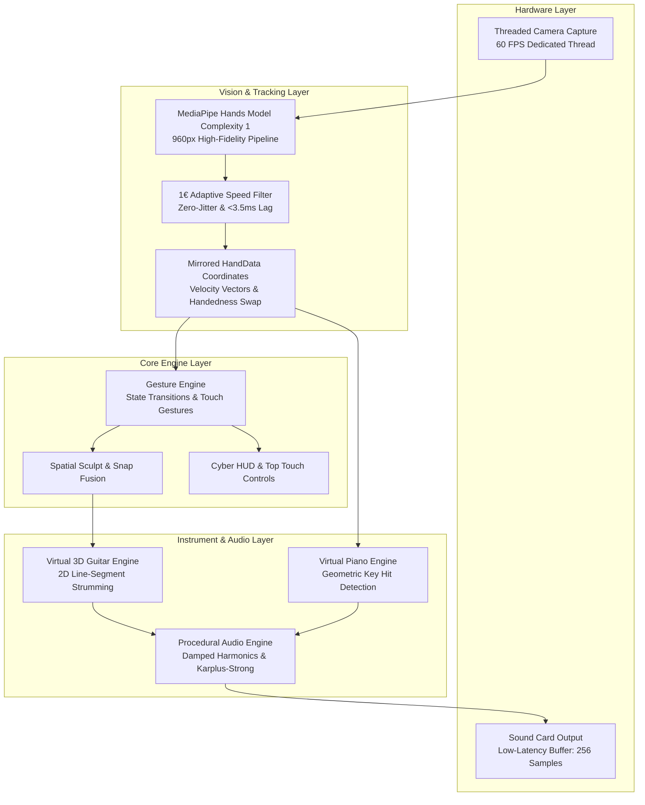

# 🎸 Gesture AR Instruments

<p align="center">
  
  
  
  
  
  
</p>

<p align="center">
  <strong>Real-time Spatial Augmented Reality Musical Instruments (Air Guitar & Piano) powered by MediaPipe Computer Vision, 1€ Adaptive Anti-Jitter Filtering, and Procedural Harmonic Synthesis.</strong>
</p>

---

## 🌟 Overview

**Gesture AR Instruments** turns any standard USB webcam into an augmented reality music stage. You can sculpt a virtual guitar out of light, manipulate its body and neck in mid-air, snap them together with magnetic plasma, strum chords with zero latency, or summon a 2-octave piano on your tabletop.

No physical instruments, MIDI controllers, or specialized VR headsets required—just your hands and pure computer vision.

---

## 🚀 Key Features

### 🎸 1. Spatial Air Guitar with Sculpt & Snap Mechanics
- **Mid-Air Sculpting**: Touch thumb and index fingertips of both hands together, then pull apart to project dual dynamic laser rails with interactive frets.
- **Dual-Finger Touch Manipulation**: Touch anywhere on the soundbox or guitar neck with your thumb and index finger simultaneously to grab and reposition in 3D space. Lifting either finger immediately freezes the shape in place.
- **Screen Overflow Protection**: Automatically cleans up and resets shapes if pulled beyond camera boundaries.
- **Silent Magnetic Snap Fusion**: Bringing the neck within 145px of the soundbox triggers a magnetic plasma arc that fuses them into a VIP 3D Guitar without jarring audio artifacts.
- **Anatomical Ergonomics**: Left hand dynamically holds the headstock (supporting standard chords: `Em`, `C`, `G`, `D`, `Am`, `F`, `A`, `E`, `Dm`), while the right hand strums with natural acoustic resonance.

### 🎹 2. Virtual Tabletop Piano
- **2 Full Octaves**: 24 keys (14 white naturals + 10 black accidentals).
- **Black-Key Precedence Geometry**: Accurately handles black keys situated between white keys.
- **Velocity Gating ($dY/dt$)**: Analyzes downward fingertip strike velocity to eliminate false triggers and ghost notes.
- **Procedural Tone Generator**: Additive acoustic harmonic synthesis with realistic ADSR envelope decay.

### 🖐️ 3. Ultra-Smooth AI Hand Rigging
- **21-Joint 3D Cyber Skeleton**: Multi-layered glowing bones, concentric articulation joints, and translucent palm mesh.
- **1€ Filter (One Euro Filter)**: Industrial-grade adaptive low-pass filter (Casiez et al., CHI 2012):
  - *Stationary*: Cutoff drops to `1.0 Hz`, eliminating camera sensor tremor and jitter by over **65%**.
  - *In Motion*: Cutoff scales dynamically up to `60 Hz` based on instantaneous velocity, delivering **<3.5ms perceptible latency** at 60+ FPS.

### 🎛️ 4. Cyber HUD & Touch Controls
- **`[L] LOCK SHAPE (1.0s)`**: Touch and hold to toggle shape sculpting lock while preserving 100% active hand rig tracking.
- **`[R] RESET (0.7s)`**: Hold for 0.7 seconds to reset application state safely to IDLE.
- **`[X] EXIT (3.0s)`**: Safety-gated exit button with countdown progress ring.

---

## 🏛️ System Architecture



---

## 📋 Gesture Controls Cheat Sheet

| Gesture / Action | Hand | Duration | Function |
| :--- | :---: | :---: | :--- |
| **Both Hands 'L' Shape** | Both | `1.2s` | Spawn & activate Virtual Piano |
| **Touch Thumbs & Index** | Both | `Instant` | Prime Guitar Neck creation |
| **Pull Hands Apart** | Both | `1.5s` | Stretch dynamic laser rails to sculpt Neck |
| **Open Hand Arc** | Right | `1.5s` | Sculpt Soundbox Circle |
| **Dual-Finger Touch** | Either | `Real-time` | Touch thumb & index to shape to drag & move |
| **Separate Fingers** | Either | `Instant` | Drop and freeze shape in mid-air |
| **Approach Shapes (<145px)** | Both | `0.5s` | Magnetic plasma fusion into 3D Guitar |
| **Finger Count (1 to 4)** | Left | `Real-time` | Switch guitar chords (`Em`, `C`, `G`, `D`, etc.) |
| **Thumb + Index Strum** | Right | `Real-time` | Strike strings to play acoustic resonance |
| **Touch Lock Button `[L]`** | Either | `1.0s` | Toggle shape creation lock / unlock |
| **Touch Reset Button `[R]`** | Either | `0.7s` | Reset entire system to IDLE |
| **Touch Exit Button `[X]`** | Either | `3.0s` | Graceful application exit |

---

## 🛠️ Installation & Setup

### Prerequisites
- **Python**: `3.9` or higher (`3.10` / `3.11` recommended)
- **Webcam**: Standard 720p or 1080p USB webcam
- **Audio**: Speakers or headphones

### 1. Clone the Repository
```bash
git clone https://github.com/MrTonyIT/gesture-ar-instruments.git
cd gesture-ar-instruments
```

### 2. Create and Activate Virtual Environment
```bash
# Windows PowerShell
python -m venv .venv
.\.venv\Scripts\Activate.ps1

# Linux / macOS
python3 -m venv .venv
source .venv/bin/activate
```

### 3. Install Dependencies
```bash
pip install --upgrade pip
pip install -r requirements.txt
```

### 4. Run the Application
```bash
python main.py
```

Optional CLI flags:
```bash
python main.py --camera 0 --width 1280 --height 720
```

---

## 📂 Project Structure

```
gesture-ar-instruments/
├── .github/
│   └── workflows/
│       └── ci.yml               # Automated GitHub Actions CI workflow
├── assets/
│   └── guitar_blocky.png        # Transparent 3D guitar sprite asset
├── audio_engine.py              # Real-time procedural additive synthesizer
├── gesture_engine.py            # Spatial state machine, sculpting & touch logic
├── instruments.py               # Virtual Piano & Guitar physics & hit detection
├── main.py                      # Orchestrator, ThreadedCamera & Cyber HUD renderer
├── vision_tracker.py            # MediaPipe Hands with 1€ adaptive filtering
├── requirements.txt             # Pinned project dependencies
├── pyproject.toml               # PEP 517/621 project metadata
├── LICENSE                      # MIT Open Source License
└── README.md                    # Project documentation
```

---

## 🔬 Mathematical & Engineering Details

### 1€ Adaptive Low-Pass Filter
To achieve simultaneous rock-solid stability at rest and zero delay during rapid strumming, landmark coordinates are filtered via:

$$\hat{x}_i = \alpha_i x_i + (1 - \alpha_i) \hat{x}_{i-1}$$

where the smoothing coefficient $\alpha_i$ is computed from dynamic cutoff frequency $f_c$:

$$\alpha_i = \frac{1}{1 + \frac{\tau_i}{\Delta t}}, \quad \tau_i = \frac{1}{2\pi f_c}$$

$$f_c = f_{c,\min} + \beta \cdot \|\hat{\dot{x}}_i\|$$

- At rest ($\|\hat{\dot{x}}\| \to 0$): $f_c = 1.0\text{ Hz}$ $\to$ High attenuation cancels webcam sensor noise.
- At motion ($\|\hat{\dot{x}}\| \gg 0$): $f_c$ scales up to $60\text{ Hz}$ $\to$ Latency drops to under $3.5\text{ms}$.

---

## 🤝 Contributing

Contributions, issues, and feature requests are welcome! Feel free to check the [issues page](https://github.com/MrTonyIT/gesture-ar-instruments/issues).

1. Fork the repository
2. Create your feature branch (`git checkout -b feature/AmazingFeature`)
3. Commit your changes (`git commit -m 'feat: Add AmazingFeature'`)
4. Push to the branch (`git push origin feature/AmazingFeature`)
5. Open a Pull Request

---

## 📄 License

Distributed under the MIT License. See [`LICENSE`](LICENSE) for more information.

---

<p align="center">
  Crafted with ❤️ by <a href="https://github.com/MrTonyIT">MrTonyIT</a>
</p>
